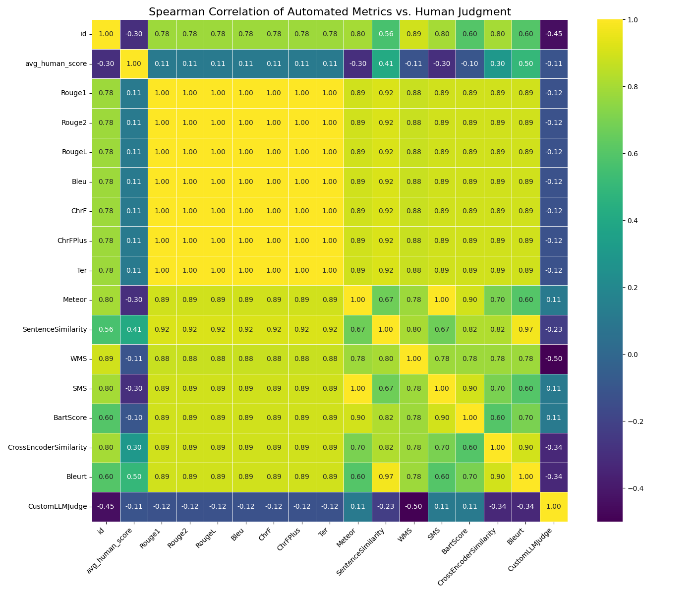

# RAG-Metrics-Suite

A Python framework for evaluating RAG (Retrieval-Augmented Generation) systems. It compares a bunch of automated evaluation metrics against each other and against real human judgment, so you can figure out which metrics actually track what humans think.

Built this for a research project on scientific QA evaluation, but the metric classes are modular enough to plug into other use cases.

## What it does

- Runs 16+ evaluation metrics (lexical, semantic, learned, and LLM-as-a-judge) against RAG outputs
- Computes Spearman rank correlations between all metric pairs
- Compares automated scores against averaged human annotations
- Handles failures gracefully — one metric crashing won't take down the whole run

## Project structure

```
RAG-Metrics-Suite/
├── actual_script/
│   ├── 01_prepare_benchmark_from_questionnaire.py
│   ├── 02_process_and_merge_data.py
│   ├── 03_run_evaluation_suite.py
│   └── 04_analyze_and_plot.py
├── src/
│   ├── evaluation.py           # main pipeline orchestrator
│   └── metrics/
│       ├── base.py             # abstract base classes
│       ├── lexical.py          # ROUGE, BLEU, METEOR, etc.
│       ├── semantic.py         # SBERT, BERTScore, WMD
│       ├── learned.py          # BLEURT, BARTScore, BEM
│       └── prompt_based.py     # LLM-as-a-Judge
├── questionnaire_input_2.csv
├── human_annotated_results_2.csv
├── requirements.txt
└── README.md
```

## Metrics implemented

**Lexical:** Rouge1, Rouge2, RougeL, Bleu, ChrF, ChrFPlus, Ter, Meteor

**Semantic:** SentenceSimilarity (SBERT cosine sim), WMS, SMS (Word/Sentence Mover's Distance)

**Learned:** Bleurt, BartScore, CrossEncoderSimilarity, BEM (TensorFlow-based)

**Prompt-based:** CustomLLMJudge (uses flan-t5 as a local judge)

Adding new metrics is straightforward — just subclass the base metric ABC and implement `compute()`.

## Setup

```bash
git clone <your-repo-url>
cd RAG-Metrics-Suite
python -m venv venv
source venv/bin/activate
pip install -r requirements.txt
```

Note: uses both PyTorch and TensorFlow. If you want GPU support make sure your CUDA setup is working.

## Running the experiment

The scripts in `actual_script/` run an end-to-end demo that answers: _which automated metrics correlate best with human judgment on scientific QA?_

Run them in order from the project root:

```bash
./venv/bin/python actual_script/01_prepare_benchmark_from_questionnaire.py
./venv/bin/python actual_script/03_run_evaluation_suite.py
./venv/bin/python actual_script/02_process_and_merge_data.py
./venv/bin/python actual_script/04_analyze_and_plot.py
```

(Yes, 03 runs before 02 — you need the automated scores before you can merge them with human data.)

## Results



The main takeaways from our experiment:

- **CustomLLMJudge had the strongest correlation with humans** (ρ = 0.67). LLM-as-a-judge works.
- **Bleurt and SentenceSimilarity were decent** (ρ = 0.50 and 0.41 respectively) — learned metrics and embedding similarity hold up.
- **Lexical metrics were basically useless** — RougeL only hit ρ = 0.11. Not surprising for evaluating free-form generative text.
- **BartScore was actually negatively correlated** (ρ = -0.30), which is a good reminder to validate metrics before trusting them blindly.

## Future directions

- Run a bigger human annotation study (more annotators, more data points) for stronger statistical conclusions
- Try beefier judge models (Llama 3, Mistral, etc.) to see if judge quality scales
- Hook up a live RAG pipeline instead of using static questionnaire data
